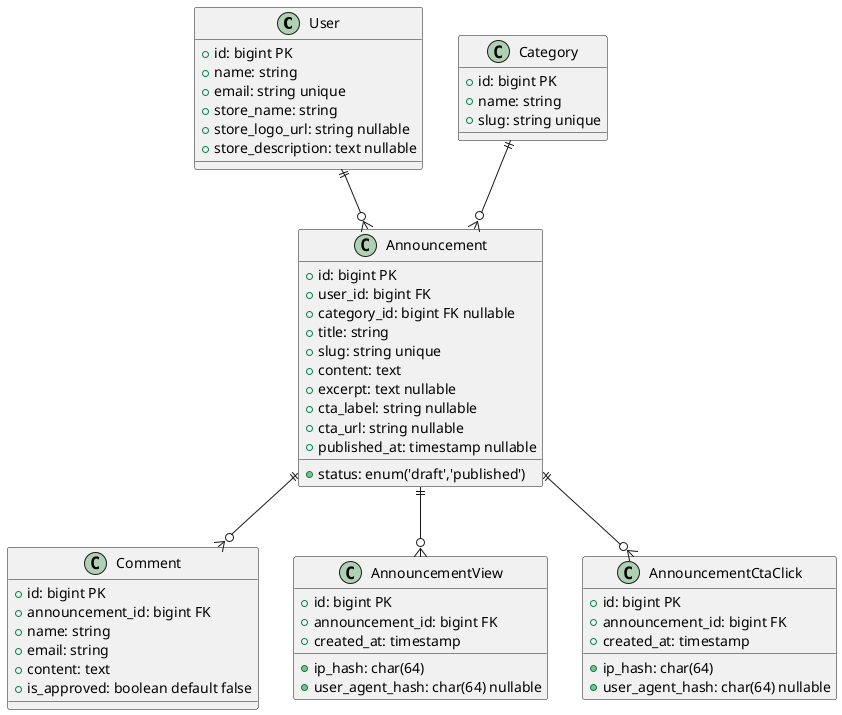

# Database Schema Documentation

This database powers a simple, high-conversion announcement blog for online sellers.  
The focus is on **clear communication**, **building customer trust** through comments, and **data-driven growth** via accurate view/CTA click tracking.

## Core Principles

- **Simple & Focused**: Announcements are short updates (not long-form articles).
- **Sales-Oriented**: Every announcement can have a Call-to-Action (CTA) button linking directly to products/checkout.
- **Trust-Building**: Moderated public comments create social proof.
- **Actionable Analytics**: Event-based tracking of views and CTA clicks enables precise conversion rate calculation.

## ER Diagram

### Recommended: DBML (dbdiagram.io)
Paste this directly into https://dbdiagram.io for the best interactive experience.

```dbml
Table users {
  id bigint [pk, increment]
  name string
  email string [unique]
  email_verified_at timestamp [null]
  password string
  store_name string
  store_logo_url string [null]
  store_description text [null]
  remember_token string [null]
  created_at timestamp
  updated_at timestamp

  indexes {
    email [unique]
  }
}

Table categories {
  id bigint [pk, increment]
  name string
  slug string [unique]
  description text [null]
  created_at timestamp
  updated_at timestamp

  indexes {
    slug [unique]
  }
}

Table announcements {
  id bigint [pk, increment]
  user_id bigint
  category_id bigint [null]
  title string
  slug string [unique]
  content text
  excerpt text [null]
  cta_label string [null]
  cta_url string [null]
  status enum('draft', 'published') [default: 'draft']
  published_at timestamp [null]
  created_at timestamp
  updated_at timestamp

  indexes {
    (user_id, status, published_at)
    slug [unique]
  }
}

Table comments {
  id bigint [pk, increment]
  announcement_id bigint
  name string
  email string
  content text
  is_approved boolean [default: false]
  created_at timestamp
  updated_at timestamp

  indexes {
    announcement_id
    is_approved
  }
}

Table announcement_views {
  id bigint [pk, increment]
  announcement_id bigint
  ip_hash char(64) [note: 'SHA-256 hash of IP for privacy']
  user_agent_hash char(64) [null]
  created_at timestamp

  indexes {
    announcement_id
    created_at
  }
}

Table announcement_cta_clicks {
  id bigint [pk, increment]
  announcement_id bigint
  ip_hash char(64) [note: 'SHA-256 hash of IP for privacy']
  user_agent_hash char(64) [null]
  created_at timestamp

  indexes {
    announcement_id
    created_at
  }
}

Ref: users.id < announcements.user_id
Ref: categories.id > announcements.category_id
Ref: announcements.id < comments.announcement_id
Ref: announcements.id < announcement_views.announcement_id
Ref: announcements.id < announcement_cta_clicks.announcement_id
```

### PlantUML Class Diagram (Alternative)



## Table Overview & Relationships

| Table                     | Purpose                                                                 | Key Relationships                              |
|---------------------------|-------------------------------------------------------------------------|------------------------------------------------|
| `users`                   | Seller account + store branding                                         | 1 → Many `announcements`                       |
| `categories`              | Organize announcements (e.g., "New Arrivals", "Shipping Updates")       | 1 → Many `announcements` (optional)             |
| `announcements`           | Core content: title, content, CTA, draft/published workflow, SEO fields | Belongs to `users` and optionally `categories` <br>Has many `comments`, `announcement_views`, `announcement_cta_clicks` |
| `comments`                | Customer questions/feedback with moderation                             | Many → 1 `announcements`                        |
| `announcement_views`      | Event-based view tracking (insert-only, scalable)                       | Many → 1 `announcements`                        |
| `announcement_cta_clicks` | Event-based CTA button click tracking                                   | Many → 1 `announcements`                        |

## Why Event-Based Analytics?

A single `analytics` row per announcement (original idea) creates hotspots and inaccurate data under load.  
Separate insert-only tables:

- Eliminate race conditions
- Scale to millions of events without locking
- Enable precise queries:  
  ```sql
  SELECT 
    a.title,
    COUNT(v.id) AS views,
    COUNT(c.id) AS cta_clicks,
    ROUND(COUNT(c.id)::decimal / NULLIF(COUNT(v.id), 0) * 100, 2) AS conversion_rate
  FROM announcements a
  LEFT JOIN announcement_views v ON v.announcement_id = a.id
  LEFT JOIN announcement_cta_clicks c ON c.announcement_id = a.id
  WHERE a.status = 'published'
  GROUP BY a.id
  ORDER BY conversion_rate DESC;
  ```

## Privacy Note

IP addresses and user agents are stored as SHA-256 hashes only — GDPR-friendly while still allowing approximate unique visitor deduplication if needed later.

## Indexes & Performance

- Composite index on `announcements(user_id, status, published_at)` for efficient admin listing
- Unique slugs for clean URLs and SEO
- Indexes on foreign keys and `created_at` for fast analytics dashboards

This schema is production-ready for Laravel 12 + MySQL 8, optimized for readability, performance, security, and real business insights.
